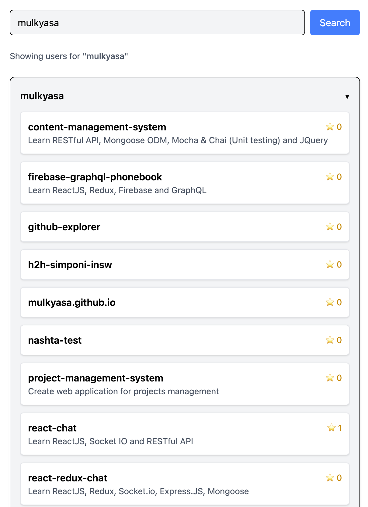

# GitHub Repositories Explorer

A simple React + TypeScript application to search GitHub users and explore their repositories.

## Features

- Search GitHub users by username (up to 5 results)
- View all repositories of a selected user
- Loading states and error handling
- Responsive UI with Tailwind CSS
- Clean and readable code structure
- Hosted on GitHub Pages

## Live Demo

[View the live demo here](https://github-explorer-three-tan.vercel.app)

> Replace with your actual GitHub Pages URL

## Preview



## Tech Stack

- [React](https://react.dev/)
- [TypeScript](https://www.typescriptlang.org/)
- [Vite](https://vitejs.dev/)
- [Tailwind CSS](https://tailwindcss.com/)
- [GitHub REST API](https://docs.github.com/en/rest)

## How It Works

- Uses GitHub Search API to find users:  
  `https://api.github.com/search/users?q={query}&per_page=5`
- Fetches all public repositories for selected user:  
  `https://api.github.com/users/{username}/repos`

## Getting Started

1. Clone the project:

```bash
git clone https://github.com/mulkyasa/github-explorer.git
cd github-explorer
yarn install
yarn dev
```
